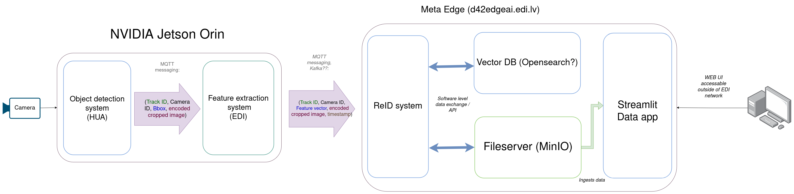

# Feature extraction container (on Jetson)

This container receives cropped vehicle images, uses a feature extraction model to convert this image into a feature embedding and sends it onward. The sending and receiving is done via MQTT messages.





# Input / Output

This FE (Feature Extraction) container acts as an intermediate processing stage between the detection system and the downstream re-identification/vector storage services.

Its responsibilities are:

* Receive cropped vehicle detections over MQTT
* Decode image MQTT payloads
* Run feature extraction inference
* Send extracted feature vectors and metadata over MQTT

(During the evaluation stage (currently) also the cropped image is sent onwards together with the embeddingvector so we can process this information / establish ground truth in a data app upstream)

---

# Input

The container subscribes to an MQTT topic and expects JSON messages with the following structure:

```json
{
    "track_id": 15,
    "cam_id": "cam_1",
    "bbox": [523, 214, 702, 412],
    "image": "<hex_encoded_jpg_or_png>"
}
```

## Input Fields

| Field      | Type      | Description                                  |
| ---------- | --------- | -------------------------------------------- |
| `track_id` | integer   | Tracking ID assigned by the detector/tracker |
| `cam_id`   | string    | Unique camera identifier                     |
| `bbox`     | list[int] | Bounding box in `[x1, y1, x2, y2]` format    |
| `image`    | string    | Hex-encoded compressed image crop            |

---

## Image Encoding

The `image` field contains:

1. Compressed image bytes (JPEG/PNG)
2. Converted to hexadecimal string representation
3. Embedded into JSON payload

The container decodes this field internally into an OpenCV image (`numpy.ndarray`) before inference.

---

## Expected Input Workflow

Expected upstream pipeline:

```text
Camera Stream
    ↓
Object Detection
    ↓
Object Tracking
    ↓
Vehicle Crop Extraction
    ↓
MQTT Publish
    ↓
Feature Extraction Container (We are here)
```

---

# Output

.png)

After inference, the container publishes a JSON message to another MQTT topic.

```json
{
    "track_id": 15,
    "cam_id": "cam_1",
    "bbox": [523, 214, 702, 412],
    "image": "<hex_encoded_jpg_or_png>",
    "features": [0.123, -0.442, ...],
    "model_name": "sp4_ep6_ft_noCEL_070126_26ep.engine",
    "timestamp_ns": 1747728320000000000
}
```

If this container ever leaved development/validation stage then the "image" field is to be removed.

---

## Output Fields

| Field          | Type        | Description                              |
| -------------- | ----------- | ---------------------------------------- |
| `track_id`     | integer     | Original tracking ID                     |
| `cam_id`       | string      | Camera identifier                        |
| `bbox`         | list[int]   | Original bounding box                    |
| `image`        | string      | Original encoded crop image              |
| `features`     | list[float] | Extracted feature embedding vector       |
| `model_name`   | string      | TensorRT engine/model used for inference |
| `timestamp_ns` | integer     | Unix timestamp in nanoseconds            |

---

### Feature Vector

The `features` field contains the extracted embedding vector produced by the ReID model.

Characteristics:

* Flattened float vector
* JSON serialized
* Used for:

  * Vehicle re-identification
  * Similarity search
  * Vector database storage
  * Cross-camera matching

The exact vector dimensionality depends on the deployed model version.

---

## MQTT Communication Notes

### Subscriber Side

The container:

* Creates a unique MQTT client ID on startup
* Subscribes to the configured input topic
* Continuously buffers received messages into an internal queue

### Publisher Side

After successful inference:

* Results are serialized into JSON
* Published immediately to the configured output topic

---

# Launching the Container

The Feature Extraction container is deployed as a Docker container on NVIDIA Jetson devices and requires:

* NVIDIA container runtime
* MQTT broker access
* MQTT TLS certificates
* Network access to the detection pipeline
* TensorRT-compatible Jetson environment

---

## Runtime Architecture

The application launches:

| Component                | Purpose                                          |
| ------------------------ | ------------------------------------------------ |
| MQTT Receiver Thread     | Receives incoming crop detections                |
| Shared Processing Thread | Performs filtering/checking and queues inference |
| Inference Worker Thread  | Owns CUDA context and runs TensorRT inference    |
| MQTT Sender              | Publishes extracted feature vectors              |

---

## Required Files

Before launching, the following files must exist on the host system (primarily you should launch the container in the same directory where these are found):

```text id="z2rj7s"
.
├── client.crt
├── client.key
├── ca-cert
└── inputs_conf.yaml
```

* inputs_conf.yaml is optional, because a preconfigured version is already inside the container. Can be imported if you want to add settings for new cameras.

These are mounted into the container using:

```sh
-v $(pwd):/certs
```

---

### Configuration File

The container expects an input camera configuration YAML file. The crop zones defined here impact where and how often will the vehicles be saved when traversing the field of view. (More on crop zones below).

Example structure:

```yaml id="pw7u1v"
streams:
  camera_1:
    mqtt_topic: "reid-vehicle-detection"
    cam_id: 'vtfw.edi.lv:63541'
    crop_zone_rows: 5
    crop_zone_cols: 4
    crop_zone_area_bottom_left: [200, 800]
    crop_zone_area_top_right: [1100, 270]
```

The configuration defines:

* Camera IDs
* MQTT topics
* Crop filtering zones
---

## Docker Runtime Parameters

### Required Docker Flags

| Flag               | Purpose                           |
| ------------------ | --------------------------------- |
| `--runtime nvidia` | Enables GPU/TensorRT support      |
| `--network host`   | Allows direct MQTT/network access |
| `-v $(pwd):/certs` | Mounts TLS certificates           |
| `--rm`             | Removes container after exit      |

---

## Application Arguments

### MQTT Configuration

| Argument            | Description                       |
| ------------------- | --------------------------------- |
| `--mqtt_broker`     | MQTT broker hostname/IP           |
| `--mqtt_port`       | MQTT broker port                  |
| `--mqtt_send_topic` | MQTT topic for extracted features |

---

### TLS Configuration

| Argument            | Description                  |
| ------------------- | ---------------------------- |
| `--mqtt_certs_path` | Path to mounted certificates |
| `--cafile`          | CA certificate               |
| `--certfile`        | Client certificate           |
| `--keyfile`         | Client private key           |

---

## Model

| Argument       | Description                            |
| -------------- | -------------------------------------- |
| `--model_name` | Specifies which model to use and uses this name in metadata |

This does select the model iteslf. The models can be found in the /model directory. Usually the newest one is selected by default. Name is also used as metadata for downstream services.

---

# Example Launch Commands

## EdgeJet 2

```sh id="7r7blj"
docker run --rm -d \
    --runtime nvidia \
    --network host \
    --name tomass_feature_extract \
    -v $(pwd):/certs \
    ghcr.io/tomasszu/reid_processes_feature_extract:jetson_2jet_latest \
    --mqtt_broker edgejet2vpn.edi.lv \
    --mqtt_port 8884 \
    --mqtt_send_topic reid-vehicle-analysis \
    --mqtt_certs_path /certs \
    --cafile ca-cert \
    --certfile client.crt \
    --keyfile client.key
```

---

## EdgeJet 3

```sh id="nq7ih7"
docker run --rm \
    --runtime nvidia \
    --network host \
    --name tomass_feature_extract \
    -v $(pwd):/certs \
    ghcr.io/tomasszu/reid_processes_feature_extract:jetson_latest \
    --mqtt_broker edgejet3vpn.edi.lv \
    --mqtt_port 8884 \
    --mqtt_send_topic reid-vehicle-analysis \
    --mqtt_certs_path /certs \
    --cafile ca-cert \
    --certfile client.crt \
    --keyfile client.key
```

---

## EdgeJet 4

```sh id="5f2qka"
docker run --rm -d \
    --runtime nvidia \
    --network host \
    --name tomass_feature_extract \
    -v $(pwd):/certs \
    ghcr.io/tomasszu/reid_processes_feature_extract:jetson_latest \
    --mqtt_broker edgejet4vpn.edi.lv \
    --mqtt_port 8884 \
    --mqtt_send_topic reid-vehicle-analysis \
    --mqtt_certs_path /certs \
    --cafile ca-cert \
    --certfile client.crt \
    --keyfile client.key
```
---

# Detection Filtering and Crop Zones

<video controls src="assets/output (online-video-cutter.com) (1).mp4" title="Crop zones example. Credits to the AI CIty challange dataset."></video>
** Credits to the AI CIty challange dataset.

Before feature extraction, incoming detections pass through a filtering stage (`CheckDetection`) to reduce redundant or low-quality crops.

The filtering logic improves:

* Feature quality
* MQTT bandwidth usage
* Re-identification consistency
* GPU utilization

---

## Minimum Crop Size Check

Detections smaller than a configured threshold are discarded.

A default:

```text
Minimum bbox width  = 70 px
Minimum bbox height = 70 px
```

<span style="color:red">If camera is further away from the road (Fisheye) then this needs to be changed!!</span>.


This avoids extracting features from:

* Very distant vehicles
* Partial detections
* Low-detail crops

---

## Crop Zone System

Each camera frame can be divided into a configurable grid of spatial zones.


Example:

```text
32 rows × 32 columns
```

Only detections that:

* Enter a new zone
* And move sufficiently

are forwarded for feature extraction.

This prevents repeated extraction from nearly identical consecutive frames.

---

## Zone Transition Logic

A detection is accepted when:

* It enters a different zone
* AND its center moved more than a pixel threshold

Current movement threshold:

```text
10 pixels
```

This avoids repeated triggering when a vehicle oscillates near zone borders.

---

## Stationary Vehicle Suppression

The system includes a spatio-temporal cache to suppress duplicate detections caused by tracker ID resets.

Typical causes:

* Parked vehicles
* Occlusion

The algorithm compares:

* Bounding box center distance
* Intersection-over-Union (IoU)
* Time since last observation

If a new detection is highly similar to a recently cached vehicle, it is suppressed instead of reprocessed.

---

## Detection Cache Expiry

Cached detections automatically expire after a configurable timeout.

Current default:

```text
300 seconds (5 minutes)
```

This prevents stale suppression state from persisting indefinitely.

---

## Fallback Crop Zones

If detections arrive from unknown cameras (not in the inputs_conf.yaml):

* A fallback full-frame (2560x2560) zone layout is created dynamically
* Zone boundaries can automatically expand if detections exceed expected frame dimensions

---

## Detection Validation Flow

```text
Incoming Detection
    ↓
Bounding Box Sanity Check
    ↓
Minimum Crop Size Check
    ↓
Crop Zone Transition Check
    ↓
Stationary Vehicle Suppression
    ↓
Accepted for Feature Extraction
```

Only detections that pass all checks are sent to the TensorRT inference worker.


## Operational Notes

## TensoRT model

> model/sp4_ep6_ft_noCEL_070126_2jet.engine

The container uses a feature extraction model in the Jetson native TensoRT framework. It has the .engine extention. TensoRT models were created by converting Torch model -> ONNX -> TensoR, with ONNX usually being a nescessary intermediate step.


## Shutdown Behavior

The container supports graceful shutdown through:

* `SIGINT`
* `SIGTERM`

### Unknown Cameras

If detections arrive from an unknown `cam_id`:

* A fallback detection checker is created dynamically
* Full-frame crop zones are used initially
* These zones can automatically expand if frame size larger than anticipated

This allows temporary compatibility with unconfigured cameras.

---

# Monitoring

Useful logs include:

```text id="j1hsm1"
[MQTT] Receiver connected successfully
[MQTT] Sender connected successfully
[inference_worker] got item for track_id=...
[inference_worker] sent features for track_id=...
```

These indicate:

* MQTT connectivity
* Successful inference
* Successful feature publishing

---

# Typical Deployment Flow

```text id="lk6z0o"
MAke sure MQTT Broker exists / start it
    ↓
Start Detection system
    ↓
Start Feature Extraction Container
    ↓
Consume Features Downstream
```


